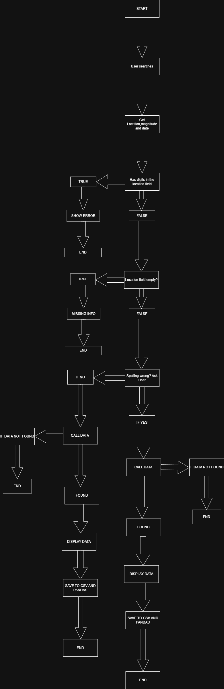
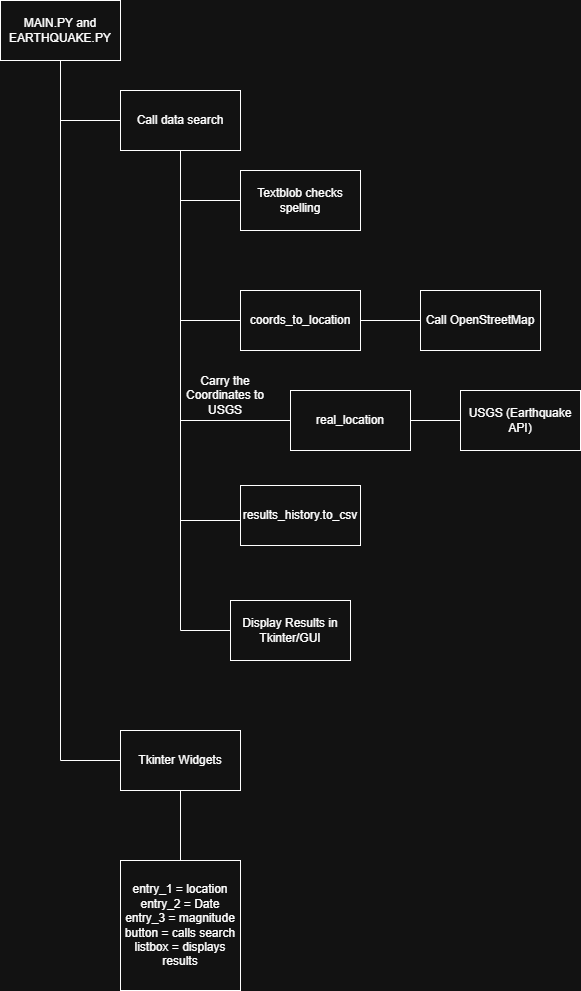
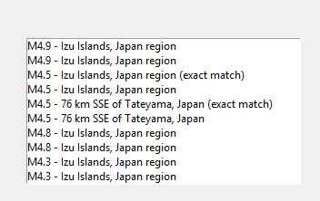
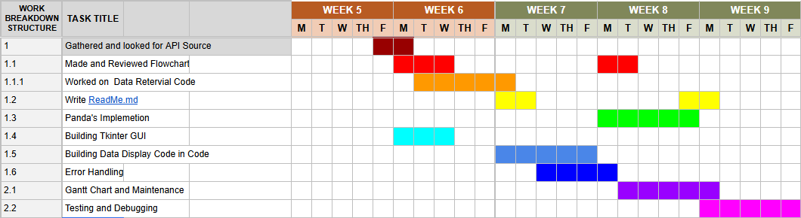
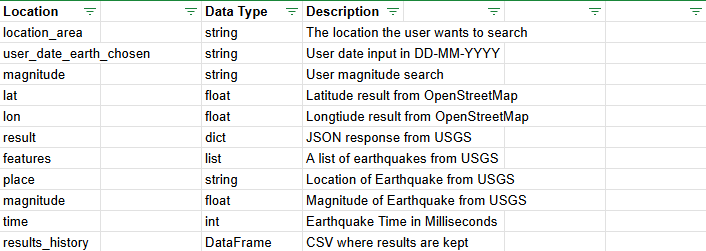

# Requirements Defintion
The program must allow the user to search by location, date and magnitude of the earthquake. As well as display the result properly and clearly.
All features should be testable, easy to debug and return results within a
reasonable time limit. As well as the ability to test error handling and bad inputs
The program handles date filitering, magnitude filitering and spell checking. Which if these processes work properly, should also allow us to test Panda's and CSV export.

# Determing Specifications (Functional and non-functional)
When a user inputs for example a just a city, it first converts the input latitude and longtiude via OpenStreetMap and sends that data to USGS, which creates a earthquake list. Another use case can involved city, date and magnitude, where it still involves the OpenStreetMap, but the rest of the data is sent to USGS immediately. Non-functional features in this program, include a quick API response time, with the user side having easy to use and clear error messasges

# Design and pseudocode

For Pseudocode is in pseudocode.txt, as formatting is broken on md files. 

 

Here is the flowchart, which displays the errors, and successes in the procedures.

A structure chart in this project shows the main functions of earthquakedata.py and main.py, which is broken into modules and how they work together. And where data is passed

# Development and Debugging

 

If a result does not completely match the input from a result, it will display like this. Which was the first plan however changed it to display 10 of the newest earthquakes in that region for more usefulness 

 

After feedback (Above) I changed it to appear 10 of the newest earthquakes in that region when there isn't an exact matching earthquake in the search. This improved functionality

 
This gantt chart displays the flow of which i developed, starting with searching for API Source, moving to practical procedures anad finally theory/development section.   

Data Dictonary describes the structured data sets and categories within this project. It is quick to understand and relate to the python code.

The two classmates I asked to review my code and actual process. Which they gave positive reviews to response times and safeguards to prevent null responses, errors and runtime failures. Where by giving them just the code and asked them to start the project themseleves, which they did successfully because the instructions in README.md. However because if an import doesnt lead to exact answer it would be useless, so in response I added a fallback where the 10 newest earthquakes in that region would appear and show to add more functionality. The GUI wasn't cluttered and without distractions and managed to not crash with mulitple searches consecutively.

# Integration (What each MAJOR module does)
Tkinter which is inbuilt in python is used for GUI implemention, which allows the user to see the actual program.
Requests in python allows the call to the API, by adding the ability for the code to interact with API'S / web service.
The two API's I used (US Geological Survey or USGS API and OpenStreetMap), are vital to the project to actual produce correct results.
Tkcalender which is part of Tkinter, grants the user to choose the date of the 
earthquake that they wish to know about.
TextBlob is part of the error handling service, which if the process detects a spelling mistake it will activate a pop-up asking the user if they typed in the input correctly.
Panda's in the project is a data cleaner and collecter. Which keeps logged data from previous inputs and results. 

# Possible future updates, bugs and possible ways this could be maintained
As we can see it displays 3 categories, but as a possible add-on a summary or map of where the earthquake happened would be feasible. 
A possible bug is where the USGS or OpenMapStreet API would crash or be unavailable, which would lead to error messages in terminal/console. The system could be maintained and updated to prevent crashes or downtime, and keeping up with updates on our API Services.  